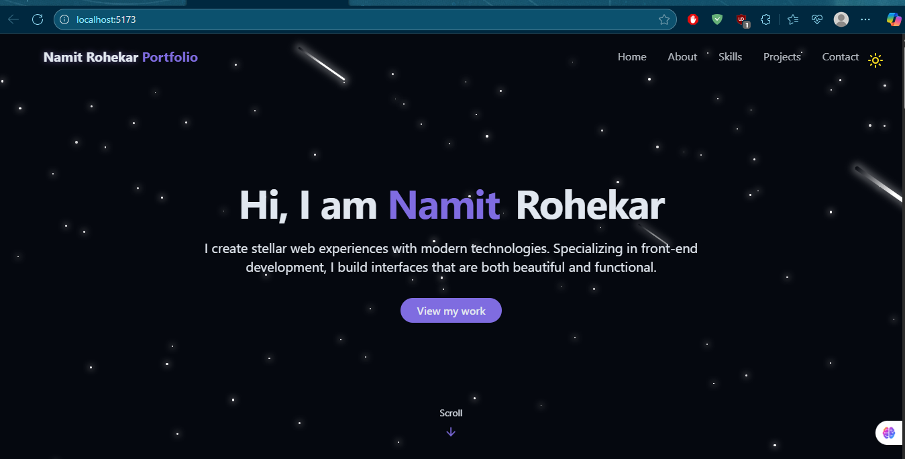
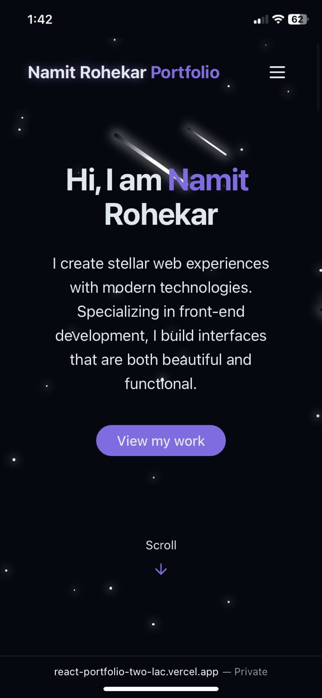

#  React Portfolio Website

A personal portfolio website built using **React** to showcase my skills, projects, and resume. This was created as part of the *Deploying on Platforms* assignment.

---

##  Features

- Fully responsive and mobile-friendly
- Sections:
  - About Me
  - Skills
  - Projects
  - Resume
  - Contact
- Light/Dark mode toggle (default: Dark)
- Smooth UI and minimal design
- Deployed on Vercel with free SSL (HTTPS)

---

##  Tech Stack

- React (Vite)
- Tailwind CSS
- Lucide Icons
- Custom Hooks
- Deployed on Vercel

---

##  Optimization

- **Lazy Loading** of components for faster initial load
- **Minified** JS and CSS files via `vite build`
- **Responsive Design** with mobile-first approach

##  Deployment

Deployed using **Vercel**
🔗 **Live Site**: [https://react-portfolio-two-lac.vercel.app](https://react-portfolio-two-lac.vercel.app)

* Free Hosting with Vercel
* Auto SSL (HTTPS)
* CI/CD via GitHub integration

---

## 📸 Screenshots

| Desktop View                        | Mobile View                       |
| ----------------------------------- | --------------------------------- |
|  |  |

---

##  Challenges Faced

* Making dark mode the default on first visit
* Ensuring pixel-perfect responsiveness on all devices
* Understanding and configuring Vercel deployment
* Placeholder email contact form (to be integrated with EmailJS)

---

##  Future Improvements

* Connect contact form with **EmailJS** for live email submissions
* Add blog or testimonials section
* Enhance animations using **Framer Motion**
* Setup a custom domain when possible

